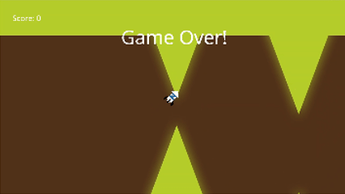

# Neat Engine


Neat Engine is a in-progress, for learning puposes, game engine.

Currently, it only supports OpenGL. Other Graphics APIs, like Vulkan, should be added in the future.

## Table of Contents
- [Prerequisites](#prerequisites)
  - [Ubuntu](#ubuntu)
  - [Windows](#windows)
- [Building Neat](#building-neat)
  - [Linux](#linux)
- [Examples](#examples)
  - [Flappy Spaceship](#flappy-spaceship)
- [Roadmap](#roadmap)

## Prerequisites

### Ubuntu

Install the required system dependencies:

```bash
# Update package list
sudo apt update

# Install build tools
sudo apt install build-essential cmake git

# Install OpenGL development libraries
sudo apt install libgl1-mesa-dev libglu1-mesa-dev

# Install X11 development libraries (required by GLFW)
sudo apt install libx11-dev libxrandr-dev libxinerama-dev libxcursor-dev libxi-dev

# Install audio libraries (required by OpenAL)
sudo apt install libasound2-dev libpulse-dev

# Verify GCC version (should be 13 or higher)
gcc --version

# If GCC 13+ is not available, install it:
sudo apt install gcc-13 g++-13
sudo update-alternatives --install /usr/bin/gcc gcc /usr/bin/gcc-13 100
```

### Windows

Install the required development tools:

1. **Visual Studio 2022** (or later)
   - Download from [Visual Studio Downloads](https://visualstudio.microsoft.com/downloads/)
   - During installation, select "Desktop development with C++"
   - Ensure C++23 language standard support is included

2. **CMake 3.28+**
   - Download from [CMake Downloads](https://cmake.org/download/)
   - During installation, select "Add CMake to system PATH"
   - Verify installation: `cmake --version`

3. **Git**
   - Download from [Git for Windows](https://git-scm.com/download/win)
   - Use default installation options

4. **OpenGL**
   - OpenGL is included with graphics drivers (no separate installation needed)
   - Ensure your graphics drivers are up to date

## Building Neat
### Linux
To build Neat on Linux, you can use the helper script `build.sh`:
```Bash
./Scripts/build.sh Release
```

By default, `build.sh` will build all targets in Debug mode. To build an specific target, you can specify it on the second argument, e.g.:
```Bash
./Scripts/build.sh Debug FlappySpaceship
```

## Examples
### Flappy Spaceship
This is the simplest possible implementation of a Flappy Bird-like game, meant to test the 2D rendering and check the ECS/events usage experience.



## Roadmap
- Vulkan Rendering (probably replace OpenGL).
- Add missing basic rendering features: draw circles, rectangles, lines, text.
- Audio Engine (OpenAL).
  - Integrate with ECS.
- Particle System.
- Renderer on a separate thread (multithreading support initiative).
  - Rendering commands queue.
- Lua Scripting.