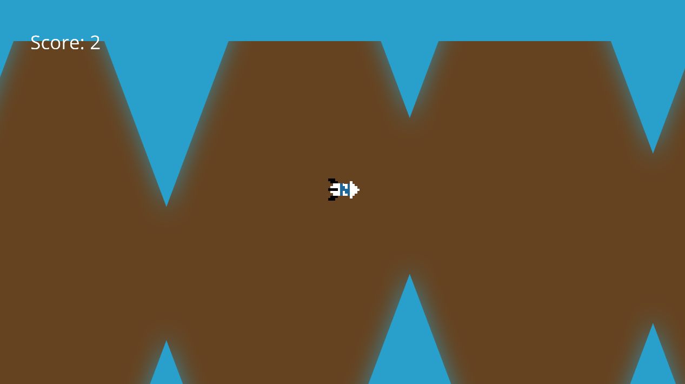

# Neat Engine

Neat Engine is a in-progress, for learning puposes, game engine.

Currently, it only supports Linux and OpenGL. Other platforms should be added once the project is more mature.

## Examples
### Flappy Spaceship
